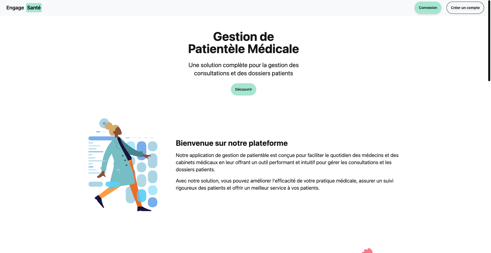
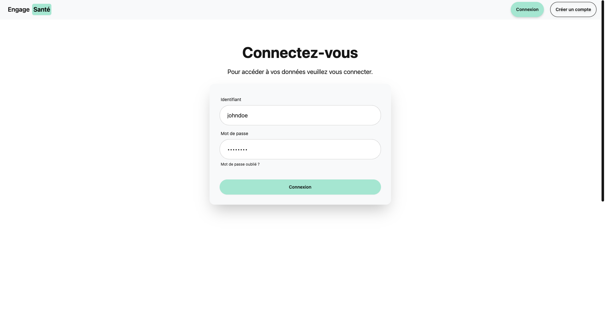
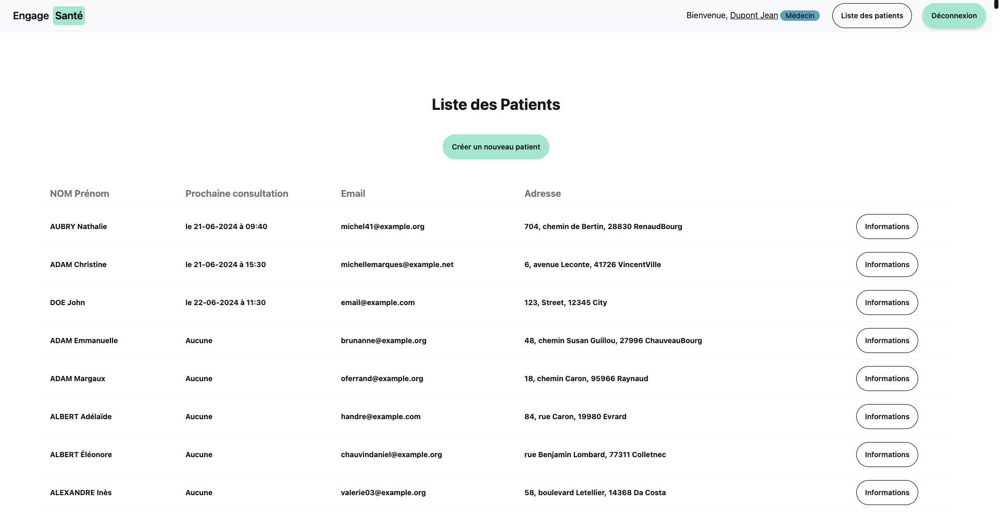
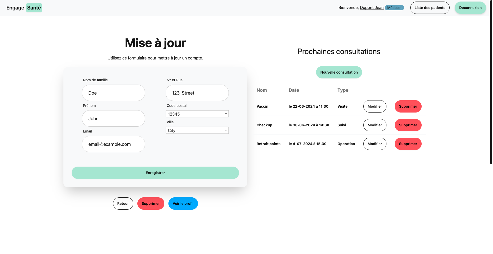
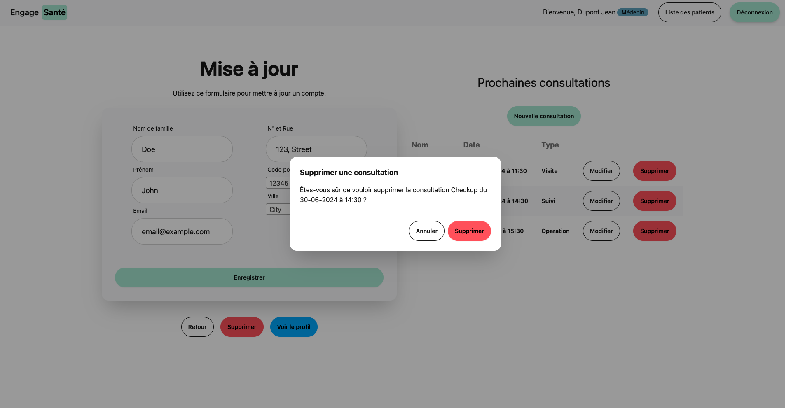
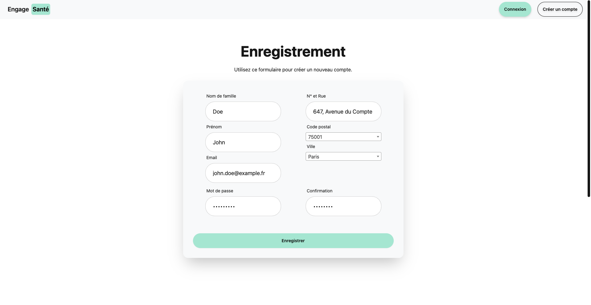
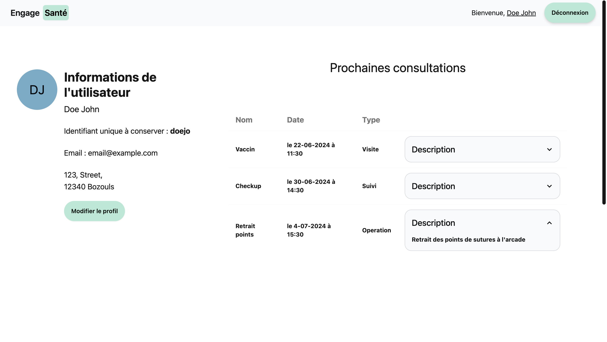
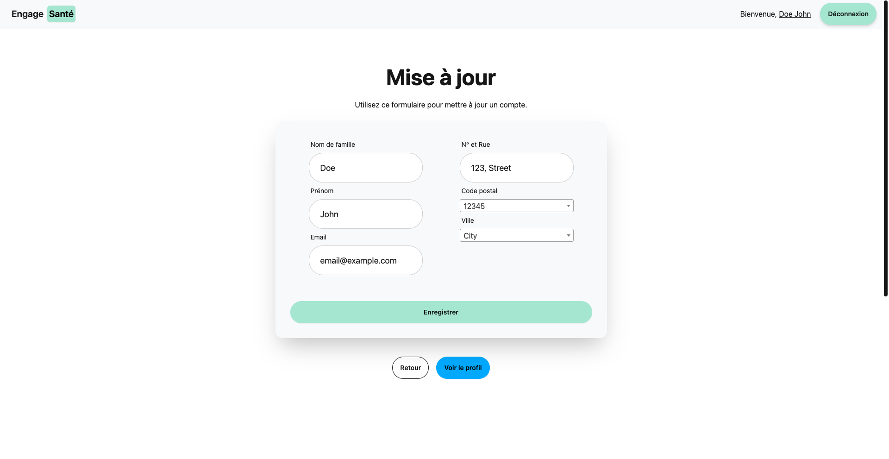
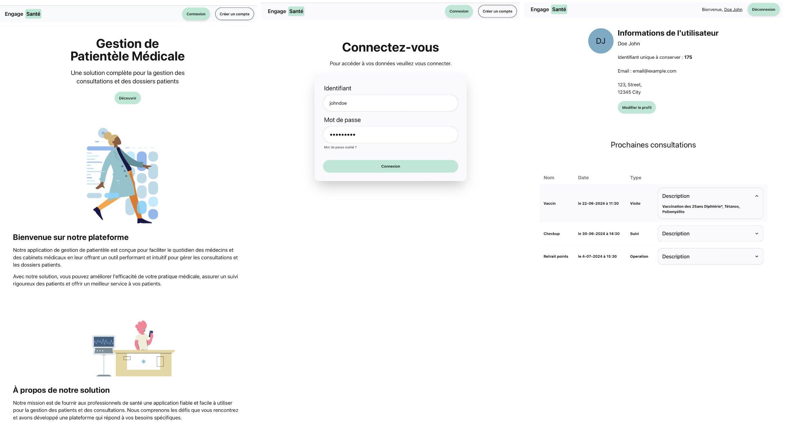
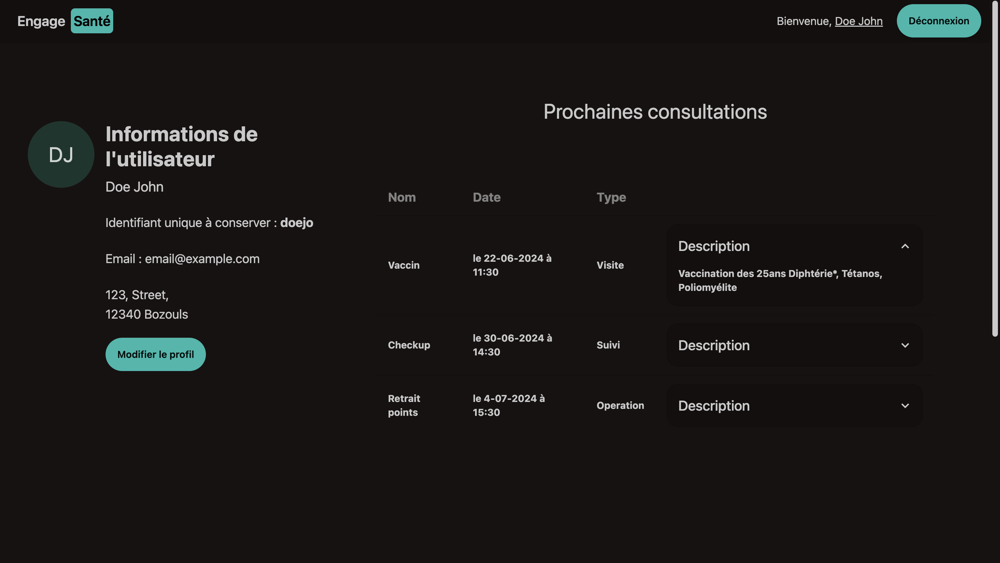

# Document d'utilisation de l'application Engage-Santé

## Page d'accueil

**Présentation** : Contient des informations relatives à l'application donnant son utilité et présentant les fonctionnalités de la plateforme.

**Fonctionnalités** :

* [Connexion](#page-de-connexion) d'un utilisateur (patient ou médecin)
* [Création d'un compte](#page-de-création-de-compte) patient

## Page de connexion

**Présentation** : Permet de connecter un utilisateur, médecin ou patient et redirigera vers la [page de compte utilisateur](#page-dinformation-utilisateur) si la connexion est effective. Cette page s'affiche aussi lorsqu'un utilisateur non connecté demande l'accès à une ressource nécessitant une authentification.

**Fonctionnalités** :

* Formulaire de connexion Identifiant + Mot de passe
* Bouton de connexion
* Message d'erreur lorsque le mot de passe est incorrect

## Page de liste des patients

**Présentation** : Une fois un **Médecin** connecté et uniquement un médecin, ce dernier verra apparaître en plus du bouton de déconnexion classique, un badge *médecin* et surtout un bouton supplémentaire pour afficher la [liste des patients](#page-de-liste-des-patients). Cette liste se compose des différents patients inscrits et est ordonnée de manière à ce que le patient ayant la consultation la plus ancienne (et donc la prochaine sur la liste) soit en haut, le reste étant organisé par ordre alphabétique. Le médecin peut ensuite accéder aux [informations du dit utilisateur](#médecin-page-de-modification-dun-utilisateur) via un bouton.

**Fonctionnalités** :

* [Visualiser et modifier les informations](#médecin-page-de-modification-dun-utilisateur) de chaque patients
* Voir la prochaine consultation

## [Médecin] Page de modification d'un utilisateur

**Présentation** : Permet à un médecin de d'[éditer] les informations d'un patient ainsi que ses consultations. Permet aussi de [supprimer](#modale-de-suppression) un patient aussi bien qu'une de ses consultations. Enfin le médecin peut aller [voir le profil de l'utilisateur](#page-dinformation-utilisateur) pour par exemple lui transmettre son identifiant unique.

**Fonctionnalités** :

* Afficher/Modifier/Supprimer un patient
* Afficher/Modifier/Supprimer les consultations d'un patient

## Modale de suppression

**Présentation** : Cette modale de confirmation s'affiche lorsque le médecin veut supprimer soit un patient soit une consultation.

**Fonctionnalités** :

* Valider la suppression d'un élément
* Annuler l'action

## Page de création/modification d'une consultation

**Présentation** : Permet de créer ou modifier une consultation, particulièrement utile pour décaler un rendez-vous.

**Fonctionnalités** :

* Créer/Modifier une consultation
* Sélection d'une date intuitive avec un picker

## Page de création de compte

**Présentation** : Permet de créer un nouveau compte patient contenant les informations suivantes.

* NOM Prénom
* Email
* Adresse complète
* Mot de passe (Avec message d'erreur en cas de mot de passe pas assez sécurisé)

Une fois le compte créé et les informations valides l'utilisateur et redirigé sur son [compte d'information](#page-dinformation-utilisateur) et découvre son identifiant de connection unique qui lui permettra de se connecter. *Exemple : John Doe -> doejo*.

**Fonctionnalités** :

* Formulaire de création de compte
* Vérification des informations

## Page d'information utilisateur

**Présentation** : Affiche les informations de l'utilisateur, notamment ses prochaines consultations et son identifiant unique. Permet aussi un accès direct au formulaire de [modification utilisateur](#patient-page-de-modification-dun-utilisateur).

**Fonctionnalités** :

* [Modification d'un utilisateur](#patient-page-de-modification-dun-utilisateur)
* Affichage des consultations
* Affichage de l'identifiant unique

## [Patient] Page de modification d'un utilisateur

**Présentation** : Permet à un patient d'éditer ses informations. Enfin le médecin peut aller [son profil utilisateur](#page-dinformation-utilisateur) pour par exemple récupérer identifiant unique. Cette page ne présente pas les fonctionnalités de suppressions ainsi que celle d'édition des consultations comme en dispose un médecin.

**Fonctionnalités** :

* Afficher/Modifier un patient

## Screenshots mobile

L'application est responsive et permet donc un affichage sur mobile.

## Theme sombre

L'application dispose aussi d'un theme sombre.

